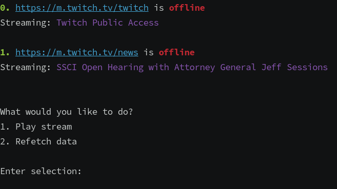

`go-twitch-online` checks if twitch users are currently streaming. It has minimal TUI. It's also possible to play the
stream. For this [streamlink](https://github.com/streamlink/streamlink) and [mpv](https://github.com/mpv-player/mpv)
should be installed on the system.

The list of streamers will be taken from `~/.config/go-twitch-online/users` which is a simple file each
line of which should hold streamer's name from twitch page url. For example if streamer's page is
`https://www.twitch.tv/foobar` then you should put `foobar` in `~/.config/go-twitch-online/users`:

```
foobar
foobar2
```
